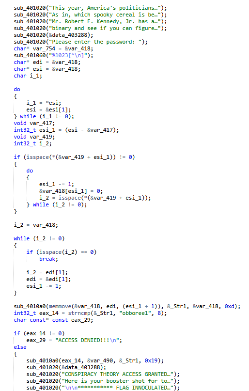
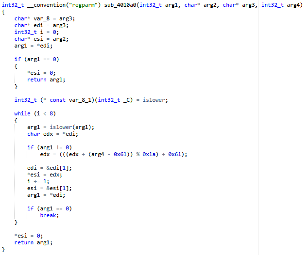

# Cereal Killer 01
 \
Реверсим бинарь, видим, что ввод юзера после каких то манипуляций сравнивается с строкой "obboreel"\
\
Судя по реверсу каждая буква меняется с каким-то константным сдвигом\
\
Забиваем "obboreel" в онлайн декриптор аффиного шифра, ищем что-то похожее на название "spooky" хлопьев\\
\
Находим строку "booberry", пробуем ее как пассворд\
\
Флаг получен