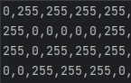
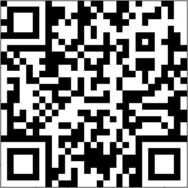

# Price Check
\
Скачиваем файлик, замечаем, что он состоит из двух цифр \
 \
Пишем небольшой скриптик, который превратит эту цсв в QR-код 
```python
from numpy import genfromtxt
import matplotlib
from matplotlib import pyplot
from matplotlib.image import imread


my_data = genfromtxt('ste.csv', delimiter=',')
matplotlib.image.imsave('output.png', my_data, cmap='gray')
image_1 = imread('output.png')
pyplot.imshow(image_1)
pyplot.show()

# csv to qr convert qr scan
```
Получаем QR-код \
 \
Сканируем его и получаем флаг
`flag{that_will_be_five_dollars}`
