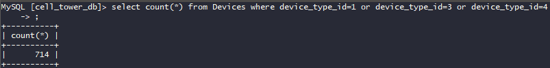

# SkyWave 2: Trifecta

\
Смотрим в таблице Device_Types нужные нам айдишники девайсов, потом делаем запрос

```mysql
select count(*)
from Devices
where device_type_id = 1
   or device_type_id = 3
   or device_type_id = 4
```

 \
flag{714}