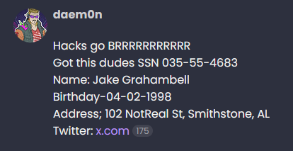
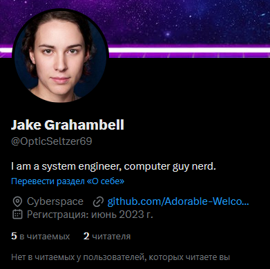
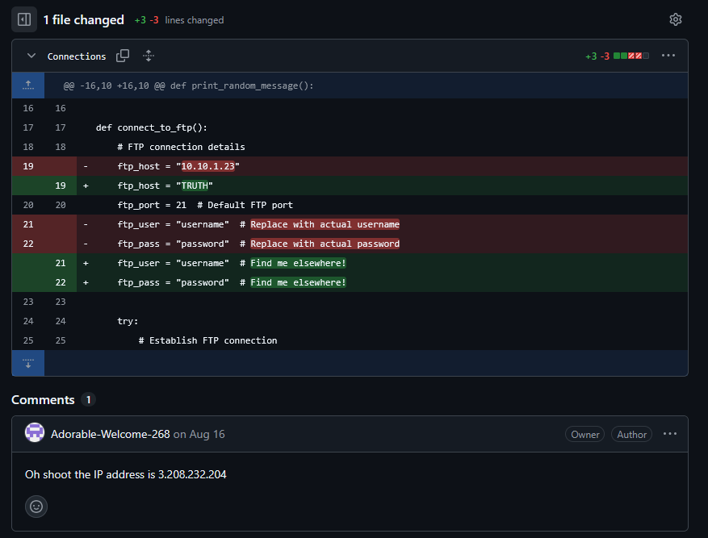
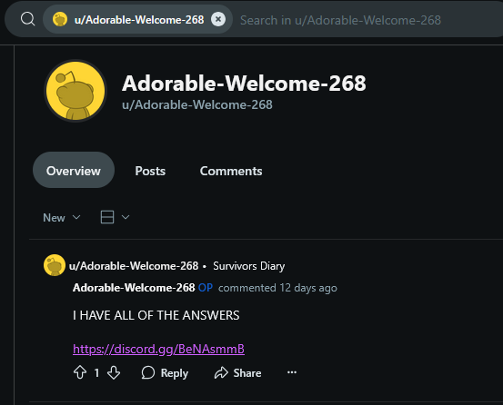

# Missing Persons


Заходим на GhostTown, ищем в поиске Jake, находим ссылку на его твиттер \
 \
https://x.com/OpticSeltzer69 \
 \
В твиттере ссылка на гитхаб профиль \
https://github.com/Adorable-Welcome-268/ \
Заходим на гит в репозиторий TRUTH, там берем код (убирая все лишнее) для подключения к фтп серверу и ищем еще зацепки \
```python
import ftplib

def connect_to_ftp():
    # FTP connection details
    ftp_host = "TRUTH"
    ftp_port = 21  # Default FTP port
    ftp_user = "username"  # Find me elsewhere!
    ftp_pass = "password"  # Find me elsewhere!

    try:
        # Establish FTP connection
        ftp = ftplib.FTP()
        ftp.connect(ftp_host, ftp_port)
        ftp.login(ftp_user, ftp_pass)
        
        print(f"Successfully connected to FTP server at {ftp_host}")
        
        # List contents of the root directory
        print("Contents of root directory:")
        ftp.dir()
        
        # Close the connection
        ftp.quit()
    except ftplib.all_errors as e:
        print(f"FTP connection failed: {str(e)}")

# Main script execution
if __name__ == "__main__":
    print("Welcome to the random FTP connection script!")
    # Attempt FTP connection
    print("\nAttempting FTP connection...")
    connect_to_ftp()
``` 
Одна из зацепок находится в комментарии к последнему коммиту: \
 \
Копаем дальше - пытаемся искать по юзернейму с гитхаба, находим юзера на реддите \
 \
Заходим по ссылочке на дискорд сервер, там видим бота с которым можно пообщаться \
 \
Исследуем дискорд и что вообще пишет наш юзер, там очень много щитпоста о всяких заговорах и о гибели группы Дятлова, пробуем это закинуть боту \
 \
Теперь у нас есть все что нужно для подключения к ftp серверу, подставляем юзернейм, пасс и айпишник, смотрим корневую директорию, и потом добавляем 
`ftp.retrbinary("RETR flag.txt.txt", open('flag.txt', 'wb').write)` что бы скачать флаг \
```
flag{dyatlov-unlikelyplaceforaparty}

THEY HAVE ME IN A PRISON deep in the mountain, tell me family I love them. DAMN YOU DYATLOV PASS
```