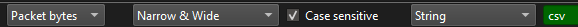
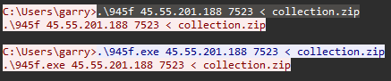
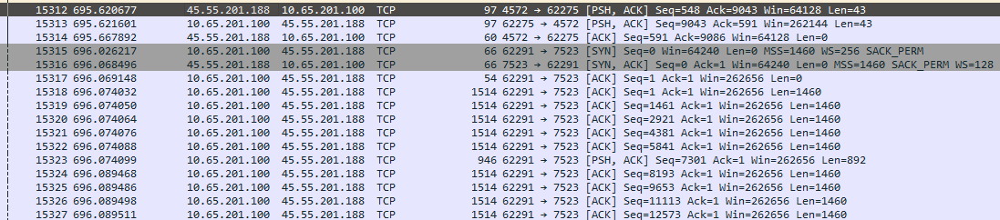
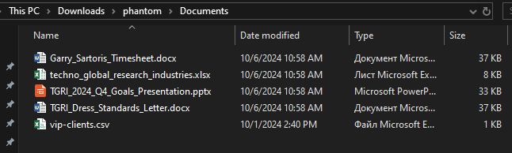
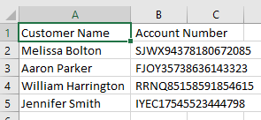

# Deep Pockets

 \
 \
Находим в conversation момент с отправкой файла, видим там после пакета с запросом на передачу файла отправку большого
количества байт \
 \
 \
Фильтруем этот стрим, выбираем в отображении RAW и жмем save as file.zip \
Распаковываем архив, открываем файлик vip-clients.csv, получаем ответ \
 \
