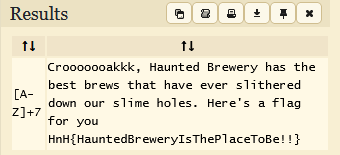

# Slimy Substitution

 \
`Jyvvvvvvhrrr, Ohbualk Iyldlyf ohz aol ilza iyldz aoha ohcl lcly zspaolylk kvdu vby zsptl ovslz. Olyl'z h mshn mvy fvb OuO{OhbualkIyldlyfPzAolWshjlAvIl!!}` \
Воспользуемся https://www.dcode.fr/cipher-identifier для идентификации шифра \
 \
Далее там же попробуем брутфорс ROT шифра и получим флаг \
