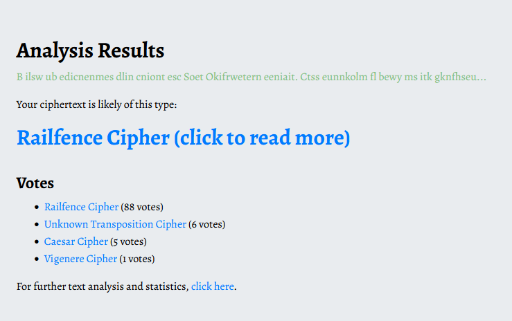
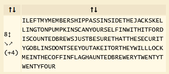
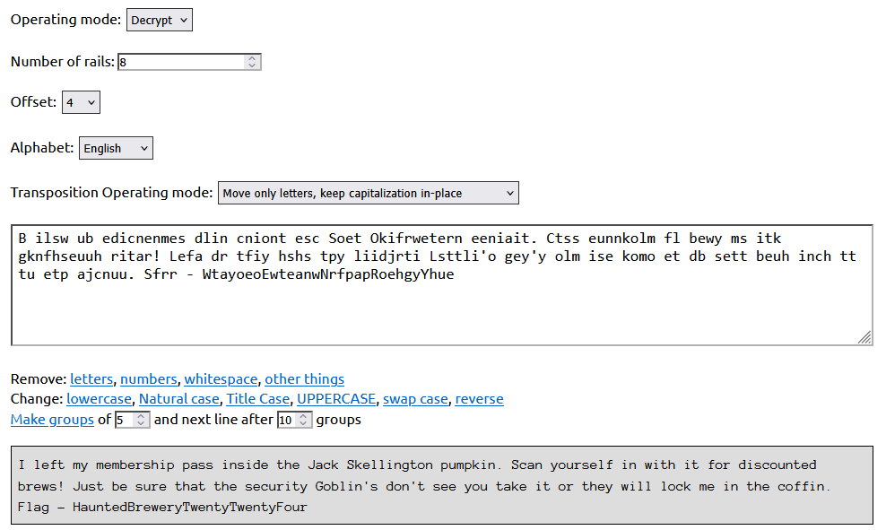

# Defencive Bartenders

\
`B ilsw ub edicnenmes dlin cniont esc Soet Okifrwetern eeniait. Ctss eunnkolm fl bewy ms itk gknfhseuuh ritar! Lefa dr tfiy hshs tpy liidjrti Lsttli'o gey'y olm ise komo et db sett beuh inch tt tu etp ajcnuu. Sfrr - WtayoeoEwteanwNrfpapRoehgyYhue`\
Воспользуемся https://www.boxentriq.com/code-breaking/cipher-identifier
\
Далее воспользуемся https://www.dcode.fr/rail-fence-cipher для брутфорса параметров\
\
Для более красивого вывода можем воспользоваться https://rumkin.com/tools/cipher/rail-fence/ \
