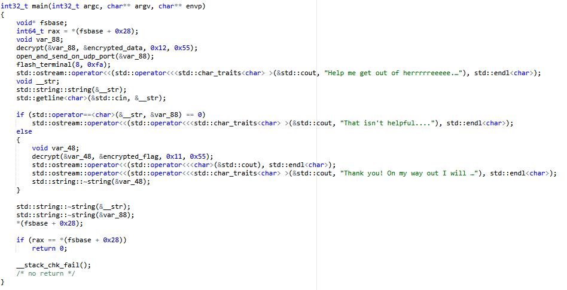
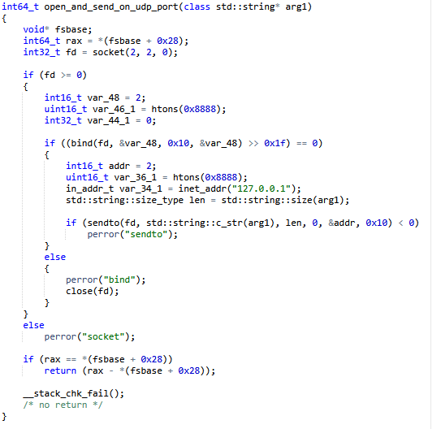
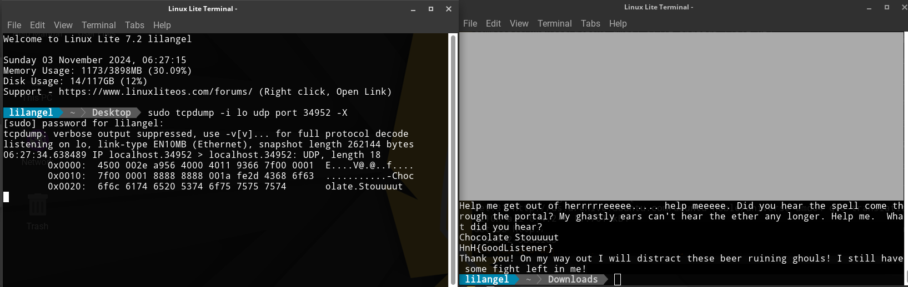

# Trapped Here

\
Реверсим файл, видим, что в main ждется какой-то ввод, в зависимости от которого мы можем получить флаг\
\
Там же видим, что у нас есть функция, которая что-то отправляет по UDP на локалхост:34952\
\
Слушаем этот порт и получаем фразу, которую нужно ввести в программу для получения флага\
