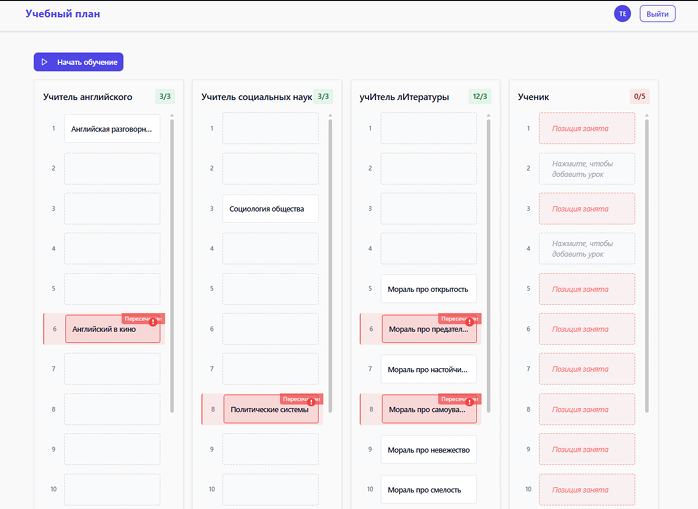
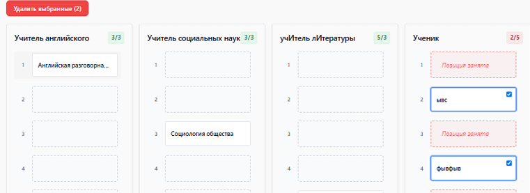
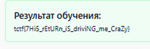

# Капибасни

Регаемся на сайте, получаем учебный план\
\
Первые три колонки мы ручками трогать не можем, последнюю можем\
Для того, что бы начать обучение нам надо пофиксить все пересечения в таблице\
Пробуем удалить урок ученику (удаляем через выделение галочкой и кнопку удалить выбранные)\
\
Получаем запросик для удаления уроков из таблицы\
Удаление происходит по айдишнику урока, которые есть у уроков из первых трех столбцов\
Дальше просто запросами удаляем мешающиеся нам уроки и жмем кнопку начать обучение\
