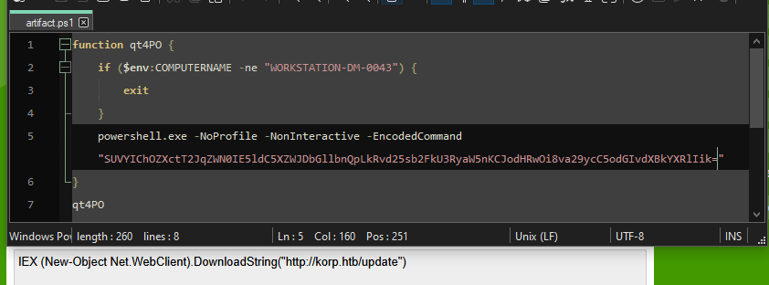
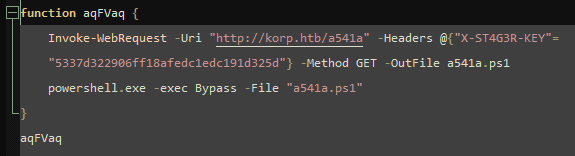
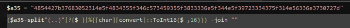

# Thorin's Amulet

Открываем файлик, декодим команду\

Получаем новый файлик, из которого понимаем что нужно курлануть с хедером\
\
В последнем файлике получаем просто зашифрованный флаг и код для его расшифровки\

HTB{7h0R1N_H45_4lW4Y5_833n_4N_9r347_1NV3n70r}