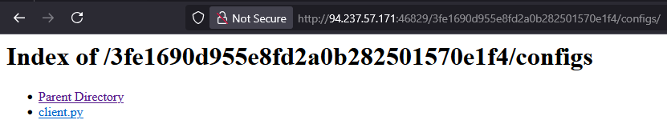

# A new Hire

В коде страницы находим ручку \\3fe1690d955e8fd2a0b282501570e1f4\\resumes\\ \
\
Гуляем по файлам пока не найдем зашифрованный в б64 флаг\
\
\
\
\
Расшифровываем и получаем флаг HTB{4PT_28_4nd_m1cr0s0ft_s34rch=1n1t14l_4cc3s!!}