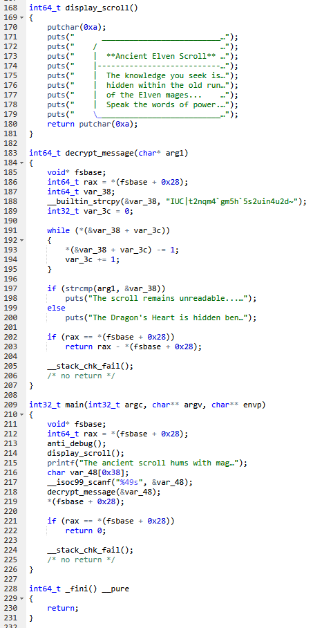

# EncryptedScroll


Реверсим бинарь, получаем закодированный флаг\
\
Пишем однострочник для получения флага
```python
print(''.join(chr(ord(c) - 1) for c in "IUC|t2nqm4`gm5h`5s2uin4u2d~"))
```
HTB{s1mpl3_fl4g_4r1thm3t1c}