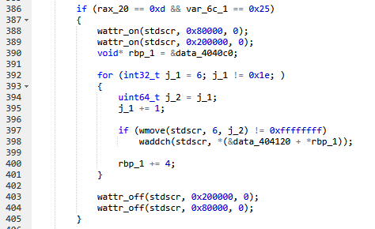

# Impossimaze


Реверсим бинарь, видим проверку на размер терминала (строки/столбцы)\
\
Ресайзим размер терминала
```bash
stty rows 13 cols 37
```
Запускаем еще раз программу, получаем флаг\
HTB{th3_curs3_is_brok3n}