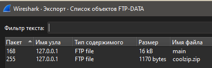
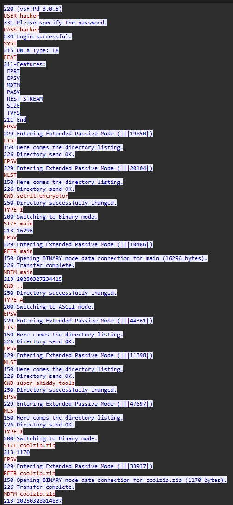
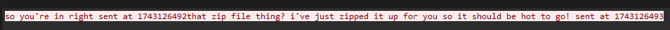
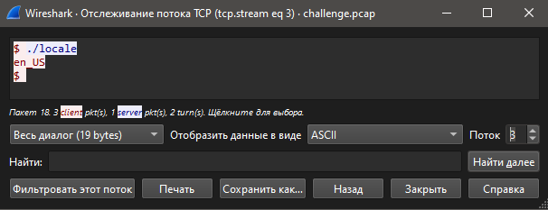
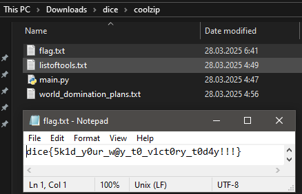

# dicecap

Открываем файл в wireshark, вытаскиваем файлы из ftp \
 \
Гуляем по потокам, находим важные зацепки что архив был как-то запаролен используя файл main \
 \
 \
Запускаем файлик main, получаем строку вида UNIXTIMESTAMPlocaleUSERNAME \
Из времени отправки получаем timestamp, логин из уже известного потока FTP, а локаль у нас заботливо оставлена в одном из других потоков \
 \
Распаковываем архив паролем `1743126480en_UShacker`, получаем секретные файлы с флагом \

