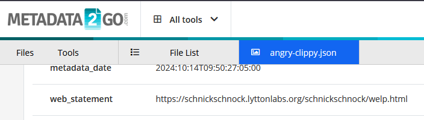

# Image of the Beast

Опять заходим на гит https://github.com/karenwrapper \
Из лора таски видим, что нам в поиске флага должен помочь Clippy \
Скачиваем пикчу angry-clippy.jpeg , смотрим в ее метадату, находим ссылку на какой-то сайт

Переходим по этой ссылке, а там лежит флаг (скриншота не осталось увы)