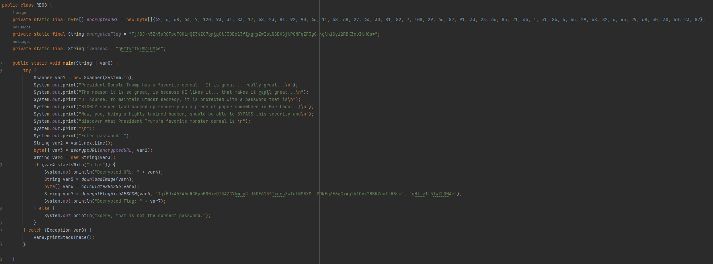
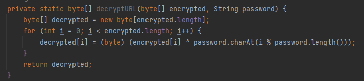
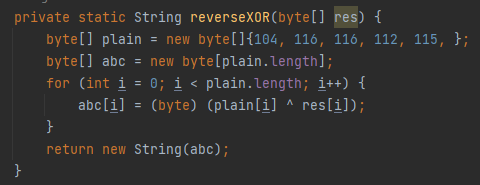
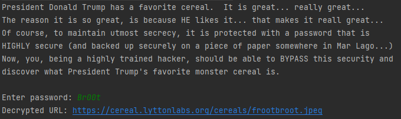
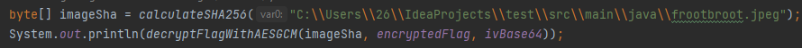
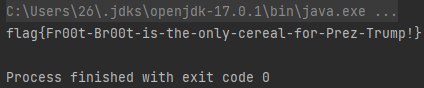

# Cereal Killer 05
\
Декомпилим jar файл\
\
\
Видим, что для декрипта юрла используется XOR, зная, что юрл начинается с "https" переводим эту строку в байты и реверсим XOR для нахождения пароля\ 
\
Получаем пароль Br00t \
Введя пароль получаем ссылку на изображение \
\
Дальше скачиваем изображение, высчитываем хэш сумму и декриптим флаг\
\
