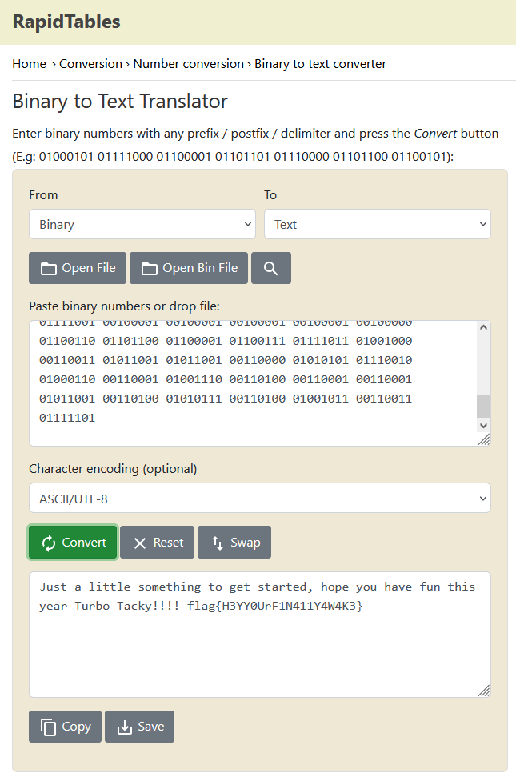

# Logical Left and Rational Right
 \
Получаем файлик, содержащий строку
`\/\\/\/\ \///\/\/ \///\\// \///\/\\ \\/\\\\\ \//\\\\/ \\/\\\\\ \//\//\\ \//\/\\/ \///\/\\ \///\/\\ \//\//\\ \//\\/\/ \\/\\\\\ \///\\// \//\//// \//\//\/ \//\\/\/ \///\/\\ \//\/\\\ \//\/\\/ \//\///\ \//\\/// \\/\\\\\ \///\/\\ \//\//// \\/\\\\\ \//\\/// \//\\/\/ \///\/\\ \\/\\\\\ \///\\// \///\/\\ \//\\\\/ \///\\/\ \///\/\\ \//\\/\/ \//\\/\\ \\/\//\\ \\/\\\\\ \//\/\\\ \//\//// \///\\\\ \//\\/\/ \\/\\\\\ \////\\/ \//\//// \///\/\/ \\/\\\\\ \//\/\\\ \//\\\\/ \///\//\ \//\\/\/ \\/\\\\\ \//\\//\ \///\/\/ \//\///\ \\/\\\\\ \///\/\\ \//\/\\\ \//\/\\/ \///\\// \\/\\\\\ \////\\/ \//\\/\/ \//\\\\/ \///\\/\ \\/\\\\\ \/\/\/\\ \///\/\/ \///\\/\ \//\\\/\ \//\//// \\/\\\\\ \/\/\/\\ \//\\\\/ \//\\\// \//\/\// \////\\/ \\/\\\\/ \\/\\\\/ \\/\\\\/ \\/\\\\/ \\/\\\\\ \//\\//\ \//\//\\ \//\\\\/ \//\\/// \////\// \/\\/\\\ \\//\\// \/\//\\/ \/\//\\/ \\//\\\\ \/\/\/\/ \///\\/\ \/\\\//\ \\//\\\/ \/\\///\ \\//\/\\ \\//\\\/ \\//\\\/ \/\//\\/ \\//\/\\ \/\/\/// \\//\/\\ \/\\/\// \\//\\// \/////\/` \
Меняем слэши на нули и единицы: \
`print(s.replace('\\', '0').replace('/', '1'))` \
Получившуюся строку декодим из бинарного вида в ascii, получаем флаг \
