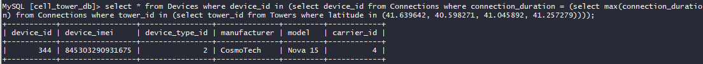

# SkyWave 4: Longest Run


```mysql
select *
from Devices
where device_id in (select device_id
                    from Connections
                    where connection_duration = (select max(connection_duration)
                                                 from Connections
                                                 where tower_id in (select tower_id
                                                                    from Towers
                                                                    where latitude in (41.639642, 40.598271, 41.045892, 41.257279))));
```

 \
flag{845303290931675}