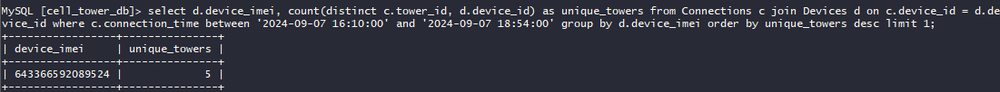

# SkyWave 5: Connections


```mysql
select d.device_imei, count(distinct c.tower_id, d.device_id) as unique_towers
from Connections c
         join Devices d on c.device_id = d.device_id
where c.connection_time between '2024-09-07 16:10:00' and '2024-09-07 18:54:00'
group by d.device_imei
order by unique_towers desc
limit 1;
```

 \
flag{643366592089524}