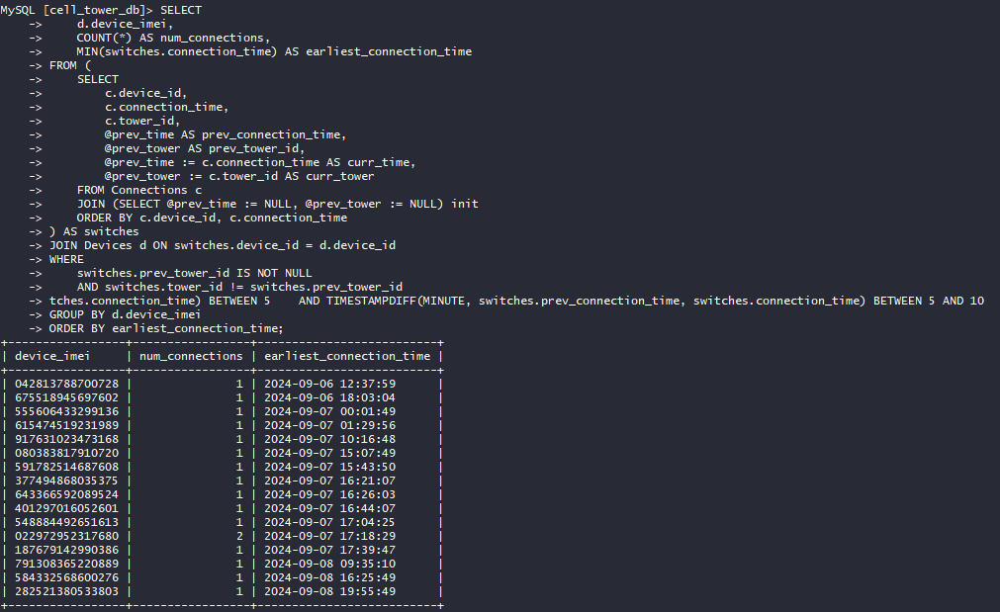

# SkyWave 6: Handoff


```mysql
SELECT d.device_imei,
       COUNT(*)                      AS num_connections,
       MIN(switches.connection_time) AS earliest_connection_time
FROM (SELECT c.device_id,
             c.connection_time,
             c.tower_id,
             @prev_time                      AS prev_connection_time,
             @prev_tower                     AS prev_tower_id,
             @prev_time := c.connection_time AS curr_time,
             @prev_tower := c.tower_id       AS curr_tower
      FROM Connections c
               JOIN (SELECT @prev_time := NULL, @prev_tower := NULL) init
      ORDER BY c.device_id, c.connection_time) AS switches
         JOIN Devices d ON switches.device_id = d.device_id
WHERE switches.prev_tower_id IS NOT NULL
  AND switches.tower_id != switches.prev_tower_id
  AND TIMESTAMPDIFF(MINUTE, switches.prev_connection_time, switches.connection_time) BETWEEN 5 AND 10
GROUP BY d.device_imei
ORDER BY earliest_connection_time;
```


Количество коннекшнов считаем ручками \
flag{17_042813788700728}
