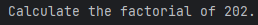
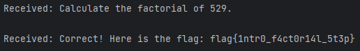

# Winning Factors
 \

Подключаемся к серверу, получаем задачку посчитать факториал какого-то числа \
 \
Пишем небольшой скриптик для решения
```python
import math
import socket

server_address = ('147.182.245.126', 33001)

with socket.socket(socket.AF_INET, socket.SOCK_STREAM) as sock:
    sock.connect(server_address)
    data = sock.recv(1024)
    print('Received:', data.decode())
    tocalc = data.decode().split(' ')[-1][:-2]
    calc = math.factorial(int(tocalc))
    sock.send(str(calc).encode('UTF-8'))
    data = sock.recv(1024)
    print('Received:', data.decode())
```
\
Получаем флаг: \
